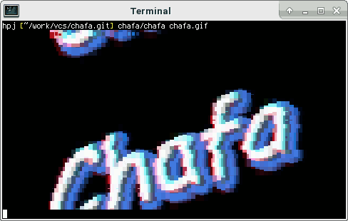

<p align="center">

</p>

Chafa is a command-line utility that converts all kinds of images, including
animated image formats like GIFs, into ANSI/Unicode character output that can
be displayed in a terminal.

It is highly configurable, with support for alpha transparency and multiple
color modes and color spaces, combining a range of Unicode characters for
optimal output.

The core functionality is provided by a C library with a public,
well-documented API.

## Building from git

```
./autogen.sh
make
sudo make install
```

## Further reading

For tarball releases, online documentation, etc. see
[the official web pages](https://hpjansson.org/chafa/).
